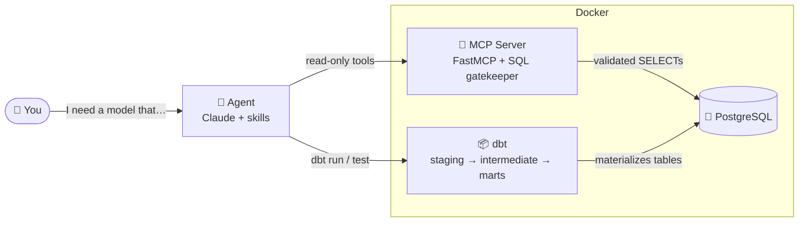
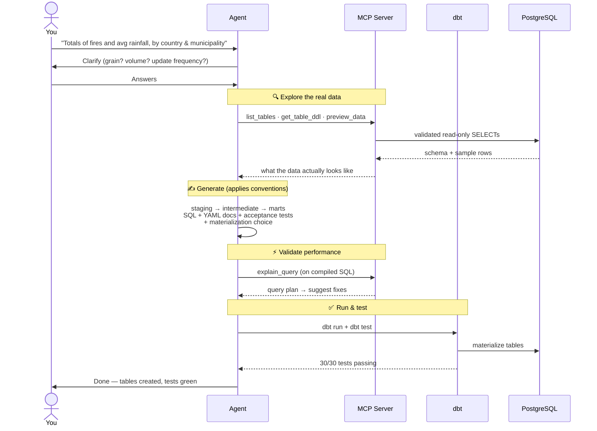

# dbt-demo-mcp

[](https://github.com/gastonlucero/dbt-mcp-demo/actions/workflows/ci.yml)
[](LICENSE)

An analytics stack where an **AI agent builds dbt models for you** — safely, by exploring the
database through a read-only **MCP server** instead of guessing.

You describe what you want in plain language. The agent asks a couple of questions, inspects the
real data, writes the SQL + tests, checks the query plan, runs it, and reports back when it's done.

---

## The big picture



- **MCP server** — exposes 4 safe tools (`list_tables`, `get_table_ddl`, `preview_data`,
  `explain_query`). Every query is parsed and validated (read-only: `SELECT`/`EXPLAIN`/`SHOW`
  only, auto `LIMIT 50`, 15s timeout). The agent can look but never touch.
- **dbt** — turns the agent's SQL into tested, materialized tables (SIM layering).
- **Docker** — runs Postgres + MCP server + dbt together.

---

## How the agent builds a model (zero → done)



Under the hood the agent follows 7 steps (the `dbt-mcp-developer` skill):

| # | Step | What happens |
|---|------|--------------|
| 1 | **Clarify** | Asks until the request is unambiguous |
| 2 | **Discover** | Inspects tables/columns/sample data via MCP |
| 3 | **Design** | Picks layering (stg→fct or stg→int→fct) + materialization |
| 4 | **Generate** | Writes SQL + YAML + acceptance tests (per `integrity` conventions) |
| 5 | **Validate** | `dbt compile` + `explain_query`, reports findings, waits for approval |
| 6 | **Test** | `dbt test` — all must pass |
| 7 | **Deploy** | `dbt run` — models materialized |

---

## Quick start

**Prerequisite:** Docker (with Docker Compose).

### Start everything with Docker Compose

```bash
# from the repo root — build images and start the 3 services in the background
docker compose -f docker/docker-compose.yml up -d --build

# check they're healthy (postgres + mcp-server + dbt)
docker compose -f docker/docker-compose.yml ps
```

This starts:

| Service | Container | Port | What |
|---------|-----------|------|------|
| `postgres` | `mcp-postgres-dev` | 5432 | PostgreSQL (loads the CSVs on first boot) |
| `mcp-server` | `mcp-server-dev` | 9001 | MCP server (read-only DB tools) |
| `dbt` | `dbt-dev` | — | dbt runtime |

Run dbt inside its container:

```bash
docker exec dbt-dev dbt run     # build all models
docker exec dbt-dev dbt test    # run all tests
docker exec -it dbt-dev bash    # open an interactive dbt shell
```

Stop / clean up:

```bash
docker compose -f docker/docker-compose.yml down       # stop & remove containers (keeps data)
docker compose -f docker/docker-compose.yml down -v     # also delete the database volume
```

> Prefer shortcuts? The `Makefile` wraps all of this: `make dev-build`, `make dbt-run`,
> `make dbt-test`, `make dbt-shell`, `make down`. (`make dev` runs Compose in the foreground.)

### Then build a model

Just tell the agent what you want, e.g.:

> *"Create a model with total fires and average rainfall per country and municipality."*

The example dataset is `raw_data.monthly_fires` (~384k satellite fire detections across Latin
America). Models materialize into the `public` schema.

**Data source:** fire detection data comes from Brazil's **INPE — Programa Queimadas** open data
portal: <https://data.inpe.br/queimadas/portal/dados-abertos/#da-focos>.

See [`CLAUDE.md`](CLAUDE.md) for the full command reference.

---

## What you can ask

You don't write SQL — you describe the result you want. The agent figures out the layers,
materialization, and tests. Real examples against this dataset:

- *"Total fires and average rainfall per country and municipality."*
- *"Rank the top 10 municipalities by number of fires, and show their average fire risk."*
- *"Monthly fire counts and average fire risk per country."*
- *"Which states have the highest average fire radiative power (FRP)?"*
- *"Municipalities where the average days without rain is above 15, with their fire totals."*
- *"Fires by biome and country, with average precipitation per group."*
- *"Compare April vs May fire counts by country."*

**A good request usually names three things** (and if you don't, the agent will ask):

| Ingredient | Example |
|------------|---------|
| **Metric** — what to measure | total fires, average rainfall, max FRP |
| **Grain** — per what | per country, per municipality, per month |
| **Filter** *(optional)* — scope | only May, only risk > 0.6, only Brazil |

> Available columns include: country, state, municipality, fire risk, precipitation (mm),
> days without rain, fire radiative power (FRP), biome, and detection timestamp.

---

## Layout

```
mcp-server/   FastMCP server + SQL gatekeeper (read-only enforcement)
dbt/          dbt project (models/, skills, conventions)
docker/       docker-compose + Postgres init (loads the CSVs)
Makefile      make dev / dbt-run / dbt-test / logs / …
```

- **Repo guide:** [`CLAUDE.md`](CLAUDE.md)
- **dbt guide:** [`dbt/dbt-demo-postgres/CLAUDE.md`](dbt/dbt-demo-postgres/CLAUDE.md)
- **Agent skills:** `dbt/dbt-demo-postgres/.claude/skills/` (`dbt-mcp-developer`, `integrity`)
